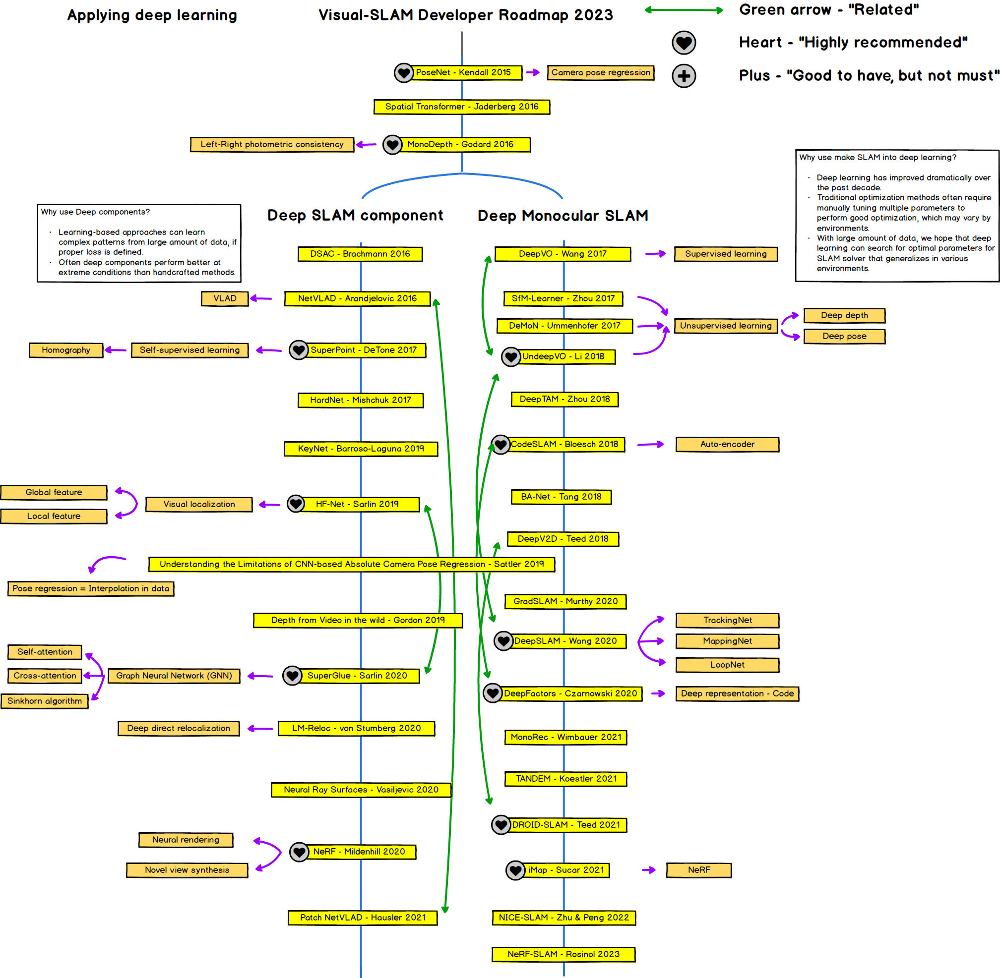

> Roadmap to becoming a Visual-SLAM developer in 2022, inspired by [web-developer-roadmap](https://github.com/kamranahmedse/developer-roadmap) and [game-developer-roadmap](https://github.com/utilForever/game-developer-roadmap).

Visual-SLAM is a special case of '[Simultaneous Localization and Mapping](https://en.wikipedia.org/wiki/Simultaneous_localization_and_mapping)', which you use a camera device to gather exteroceptive sensory data. 

Below there is a set of charts demonstrating the topics you need to understand in Visual-SLAM, from an absolute beginner difficulty to getting ready to become a Visual-SLAM engineer / researcher.

 

***

Visual-SLAM is often portrayed as a rather difficult topic - many think good C++ programming skills and deep understanding of mathematics is necessary.

On the other hand, there are not many courses provided for beginners, especially in non-English languages. 

I made these charts to share my thoughts and experience on studying Visual-SLAM, and hopefully the beginner learners can get a grasp of where to start from.

 

***
<h3 align="center"><strong>Purpose of these Roadmaps</strong></h3>

> The purpose of these roadmaps is to give you an idea about the general overview of Visual-SLAM, and to guide you if you are confused about where to start from. 

<h3 align="center"><strong>Note to Beginners</strong></h3>

> Acknowledge that SLAM has a relatively high entry barrier - it's not because of the requirement of undertanding difficult mathematics, but the requirement of equipping yourself with various types of skills. Don't feel overwhelmed - you don't need to learn everything if you are just getting started. Instead, enjoy the journey itself and progress topic by topic. The result will be very rewarding.

 

***

 

## Beginner

 

## Getting familiar with SLAM

> Disclaimer: You don't need to know *every single element* in this chart to advance to the next level! 

 

## Monocular Visual-SLAM

 

## RGB-D Visual-SLAM

 

## Applying Deep Learning

## TODO:

> Last updated: 2023.01.14

- Stereo SLAM
- VIO / VINS
- Collaborative SLAM
- Visual-LiDAR Fusion
- Event-based vision

- Useful links for learning

## 🚦 Wrap Up

If you think any of the roadmaps can be improved, please do open a PR with any updates and submit any issues. Also, I will continue to improve this, so you might want to watch/star this repository to revisit.

> Also, check out my [GitHub](https://github.com/changh95) and [blog](http://www.cv-learn.com) :smiley_cat:

## 🙌 Contribution

The roadmaps are built using [Balsamiq](https://balsamiq.com/products/mockups/). Project file can be found at `/project-files` directory. To modify any of the roadmaps, open Balsamiq, click **Project > Import > Mockup JSON**, it will open the roadmap for you, update it, upload and update the images in readme and create a PR.

- Open pull request with improvements
- Discuss ideas in issues
- Spread the word
- Reach out to me directly at hyunggi.chang95[at]gmail.com.

## :rocket: Discussion

To discuss any topics or ask questions, please use the [issue tab](https://github.com/changh95/visual-slam-roadmap/issues).

## License

The class is licensed under the [MIT License](http://opensource.org/licenses/MIT):

Copyright &copy; 2020 [Hyunggi Chang](http://www.github.com/changh95).

Permission is hereby granted, free of charge, to any person obtaining a copy of this software and associated documentation files (the "Software"), to deal in the Software without restriction, including without limitation the rights to use, copy, modify, merge, publish, distribute, sublicense, and/or sell copies of the Software, and to permit persons to whom the Software is furnished to do so, subject to the following conditions:

The above copyright notice and this permission notice shall be included in all copies or substantial portions of the Software.

THE SOFTWARE IS PROVIDED "AS IS", WITHOUT WARRANTY OF ANY KIND, EXPRESS OR IMPLIED, INCLUDING BUT NOT LIMITED TO THE WARRANTIES OF MERCHANTABILITY, FITNESS FOR A PARTICULAR PURPOSE AND NONINFRINGEMENT. IN NO EVENT SHALL THE AUTHORS OR COPYRIGHT HOLDERS BE LIABLE FOR ANY CLAIM, DAMAGES OR OTHER LIABILITY, WHETHER IN AN ACTION OF CONTRACT, TORT OR OTHERWISE, ARISING FROM, OUT OF OR IN CONNECTION WITH THE SOFTWARE OR THE USE OR OTHER DEALINGS IN THE SOFTWARE.
